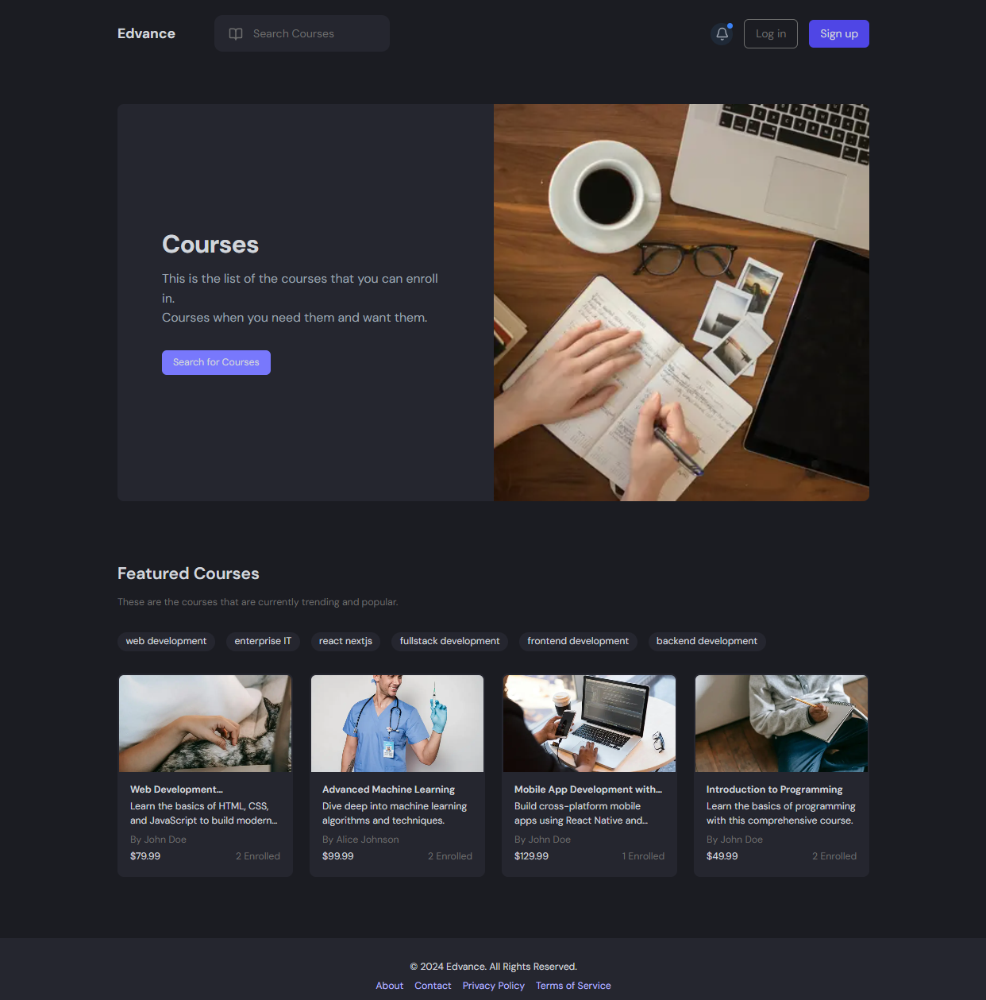

# Edvance – Video-Centric E-learning Platform

**Tech Stack:**  
TypeScript • Next.js • Node.js • AWS Lambda • API Gateway • DynamoDB • S3 • CloudFront • GitHub Actions

## Overview

Edvance is a full-stack video-centric e-learning platform designed to provide an end-to-end online education experience.  
It enables teachers to create courses, upload and stream videos, manage billing, and securely authenticate users.  
Students can browse, purchase, and consume course content with a seamless and responsive UI.

🚀 **Live Demo:** [Edvance on Vercel](https://edvance-dxif3sawf-michael-yzhous-projects.vercel.app/)



---

## Features

- **Course Creation** – Teachers can create and manage courses with a step-by-step wizard.
- **Video Uploading & Playback** – Upload videos to AWS S3, accessed globally via CloudFront.
- **Secure Authentication** – User sign-up/sign-in handled via [Clerk](https://clerk.com) with role-based access control.
- **Checkout & Billing** – Integrated Stripe payment gateway for purchasing courses.
- **Responsive UI** – Built with modern web design principles for desktop and mobile users.
- **Cloud-Native Backend** – Fully serverless backend powered by AWS Lambda and API Gateway.
- **Automated Deployments** – CI/CD pipeline using GitHub Actions.

---

## Architecture

**Frontend**

- Built with **Next.js** and **TypeScript**
- Client-side routing, server-side rendering (SSR), and API integration via REST

**Backend**

- **AWS Lambda** host docker image and exposed via API Gateway
- **DynamoDB** for storing user, course, and transaction data
- **S3** for video storage
- **CloudFront** for global low-latency video delivery

**Authentication**

- Powered by Clerk for secure, scalable user management

**Deployment**

- Frontend deployed on Vercel
- Backend and infrastructure hosted on AWS
- CI/CD automated with GitHub Actions for production deployments
- Static assets stored in S3 and served via CloudFront

---

## Tech Highlights

- **TypeScript** for both frontend and backend
- **REST API** design and implementation
- **Cloud Architecture** with AWS serverless stack
- **Database Design** with NoSQL DynamoDB modeling
- **Deployment Automation** with GitHub Actions workflows

---

## Getting Started

### Prerequisites

- Node.js 22
- AWS account (with IAM permissions for Lambda, S3, DynamoDB, CloudFront)
- Clerk account for authentication

### Installation

1. Clone the repository:
   ```bash
   git clone https://github.com/Michael-YZhou/Edvance
   cd edvance
   ```
2. Install dependencies for both client and server:

   ```bash
   # Install client dependencies
   cd client
   npm install

   # Install server dependencies
   cd ../server
   npm install
   ```

3. Set up environment variables:

   - In /client, create a .env.local file
   - In /server, create a .env file for AWS Lambda functions
   - Include variables for:
     - AWS credentials & config
     - Clerk API keys
     - Payment provider keys (e.g., Stripe)

4. Run the development server:

   Open two terminals:

   **Client (frontend)**

   ```bash
   cd client
   npm run dev
   ```

   **Server (backend)**

   ```bash
   cd server
   npm run dev
   ```

- Frontend: http://localhost:3000 (default port)

- Backend: Runs on its configured local API port (e.g., http://localhost:8001)

## Deployment

- **Frontend:** Automatically deployed to Vercel on push to main

- **Backend:** Deployed to AWS Lambda via GitHub Actions CI/CD pipeline (or manually on AWS Console)

- **Assets:** Stored in S3 and delivered via CloudFront

## License

This project is licensed under the MIT License.
